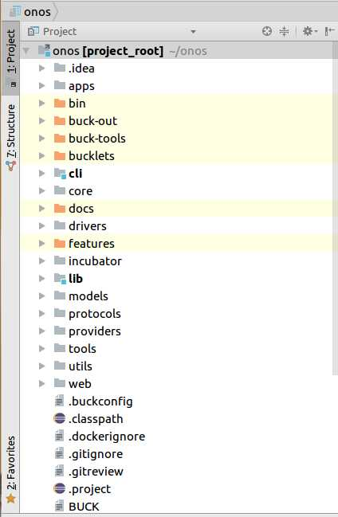
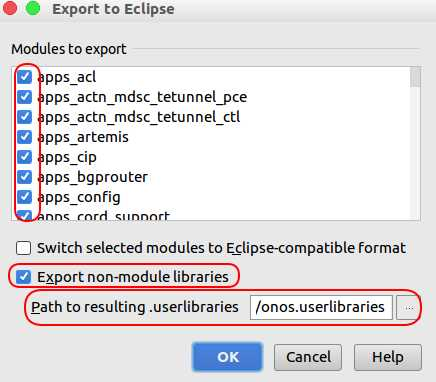
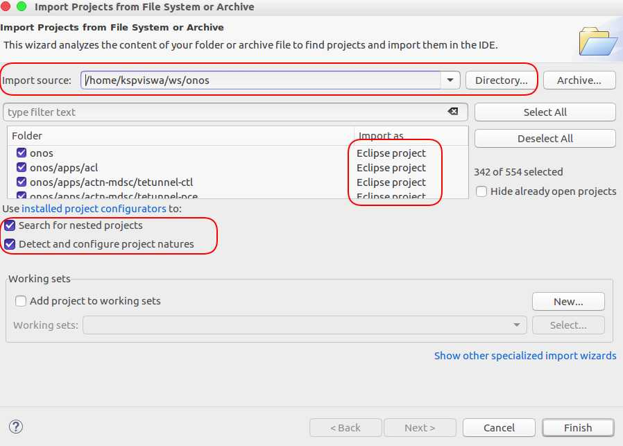
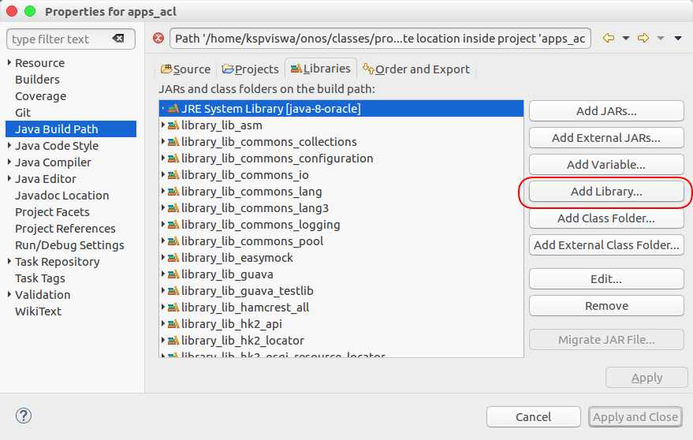
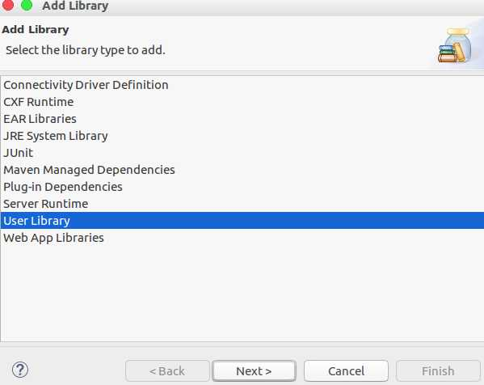
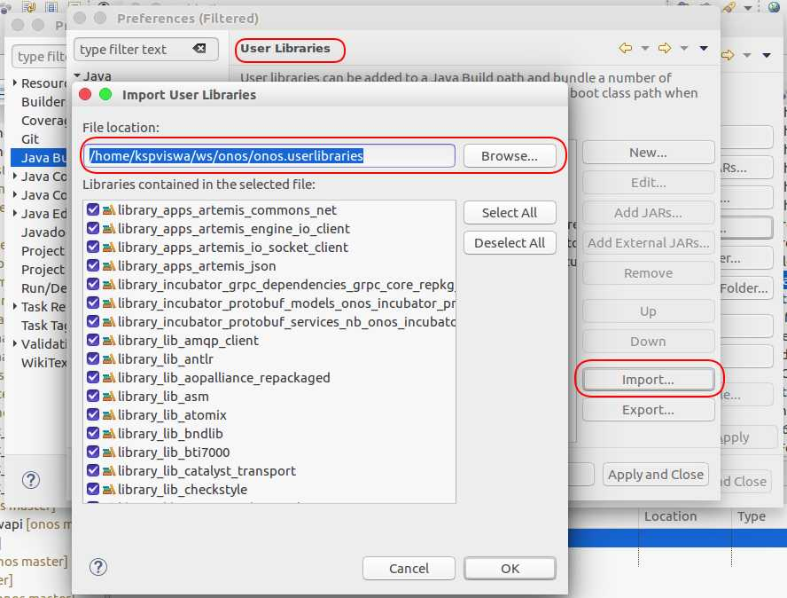
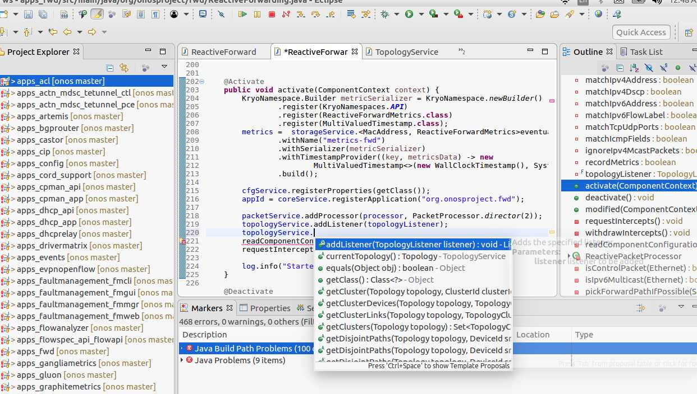

ONOS project started using [BUCK](https://buckbuild.com/) from 1.7.0 humming bird release. **Buck** is a build tool developed by Facebook,
and supports highly parallel and incremental builds. To build ONOS, we simply need to run the `$ONOS_ROOT/tools/onos-buck build onos` command.

For more information on how to write ONOS app based on BUCK, please refer my earlier post [ONOS Application Tutorial - Create an app using BUCK](http://kspviswa.github.io/creating-an-app-ONOS-using-BUCK.html)

Though ONOS development have been migrated to BUCK, you can see legacy maven style `pom.xml` files still lingering in the codebase. This is due to the fact that, there are still some gaps with *BUCK*  build system. One of gaps for completely obsoleting POM files ( i.e enable ONOS to build completely using BUCK... which is simply *purge* all `pom.xml` files ) is **Eclipse support**.

**BUCK** has a command option namely `buck project` which when used, will produce IDE project files, so that those files can be readily imported into IDE, thereby reducing the initial dev environment setup time. It also aids in providing consistent view & performance to all developers in the community. 

While this sounds completely cool, unfortunately **BUCK** doesn't seem to care about **Eclipse**. Today using `$ONOS_ROOT/tools/onos-buck project` command, you can only generate **IntelliJ IDEA** based project files only.  For **Eclipse** you still have to follow *maven* based project import. This is one of the prime reason why ONOS folks are reluctant in obsoleting the POM files.

Recently, a new brigade ( namely [ONOS Build & Package Infrastructure brigade](https://wiki.onosproject.org/display/ONOS/Build+and+Package+Infrastructure+brigade)) was formed to address such needs pertaining to build & packaging challenges of ONOS. ( Ahem... well yeah... I'm part of this brigade as well.. ).

While adding support for **Eclipse** in **BUCK**, is a work in progress, In this post, I'm gonna explain how to use existing eclipse import feature in IntelliJ IDEA in-order to achieve desired effect as a work-around.

## Prerequisites

You need to have both **IntelliJ IDEA** and **Eclipse** to go through further contents in this post. Just go-ahead, download & install these IDEs from their respective sites. Both IDEs are well suited for any kind of development, so there is no harm in keeping these two in your rack.

## Step 1 : Generate IntelliJ IDEA Project files first

The best way to reach **Eclipse** is via **IntelliJ IDEA**. Like I had explained before, **BUCK** has already got **IDEA** covered. So lets go-ahead and generate **Intelli J IDEA** based project files.

Simply copy & paste & run like below:

<code>
$ONOS_ROOT/tools/build/onos-buck project
</code>

This command would have generated necessary libraries, JARs & `*.iml` files. You will also see `project_root.iml` file which is the root file of your project.

Now go-ahead and simply open this file via **IntelliJ IDEA**, you can see entire code beautifully structured with code completion etc..

## Step 2 : Use IntelliJ's `export to eclipse` option

Next step is to export **IntelliJ** Project files as **Eclipse** projects. This is nothing but converting `*.iml` files to `.classpath` & `.project files`.

 To achieve that, simple invoke the **Export to Eclipse...** option from ***File -> Export to Eclipse...***

 Here pay attention to areas that have been marked. Ensure that, you are selecting all projects to export and also select **Export non-module libraries**. This will come handy in next step. Provide a path where you want to save the **onos.userlibraries** file ( which is basically an `xml` file ).

 After you press OK, IntelliJ would then convert your selected projects to corresponding eclipse format ( i.e `.classpath` & `.project` files ).

## Step 3 : Open Eclipse project files in Eclipse IDE 

Now that you had generated eclipse project files, now go ahead and open these files directly in Eclipse. You can do that by **File -> Open Projects from File system or archive** menu option.

 In the **Import Source**, provide the `$ONOS_ROOT` location. Eclipse will then try to find eclipse compatible projects files. Ensure that, you have enabled **Search for nested projects** & **Detect and configure project natures** options.

**Note: Ensure that all the projects should be imported as `eclipse project` only.**

 If you happen to find `maven project`, then try removing all `pom.xml` files temporarily and then try again. You can do this in one command as follows:

<code>
find . -name pom.xml | xargs rm
</code>

You can then easily reset by issuing `git checkout *`

After you press **Finish**, all modules will be imported as eclipse project and be available in workspace.

## Step 4 : Fix the build path

This is the last step of the migration. In-order to have IDE features like code completion, navigation etc, you need to fix the build path. Here is where **onos.userlibraries** will help us. Lets get started.

 In order to fix build path, select all projects and enter into the **Properties** and select *Build path* as below.

Here you need to select **Add Library** and on the following screen, you need to select **User library** as shown below.

Next, you need to **Import** the *onos.userlibraries*  by navigating to the path where you had earlier saved it from IntelliJ. It is really that simple :-) .

## Step 5 : Enjoy developing / hacking ONOS under Eclipse

That's it, now you have successfully landed in Eclipse zone and eclipse users, just **Feel at home** .

